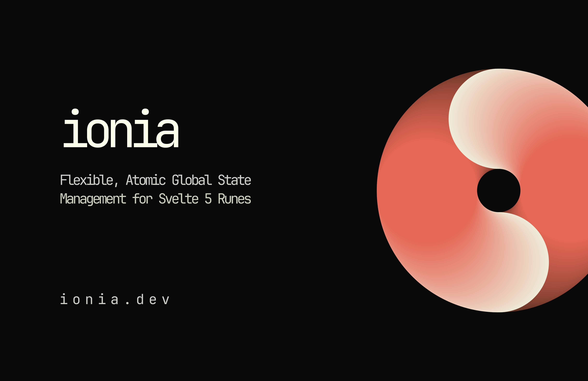

# Ionia
[Ionia Website](https://ionia.dev)

📃 Flexible, Atomic Global State Management for Svelte 5 Rune

Usage:

Define your stores:

```typescript
import { ion } from 'ionia';

export const counterStore = ion(0);
```

Usage in svelte files:

```svelte
<script lang="ts">
 	import { ionize } from 'ionia';
	import { counterStore } from '$stores';

	let counter = ionize(counterStore);
</script>

<button onclick={() => counter++}>Increment Counter</button>
```
